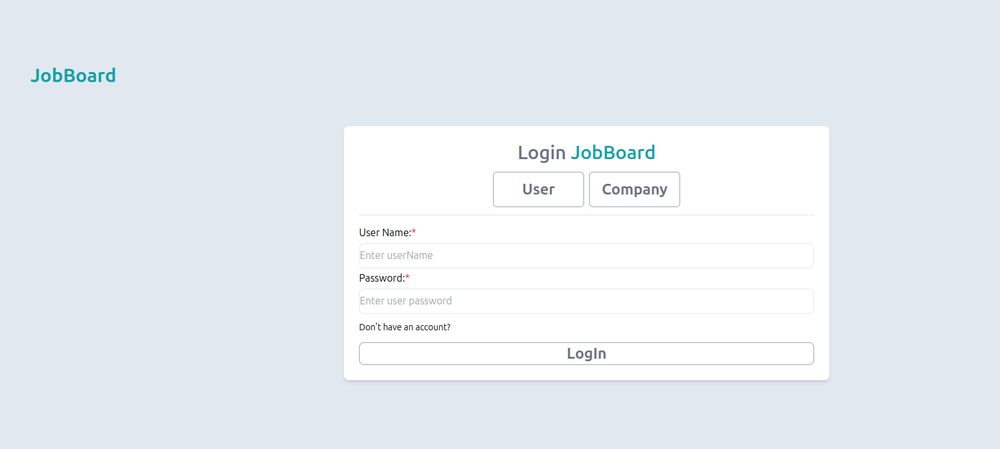
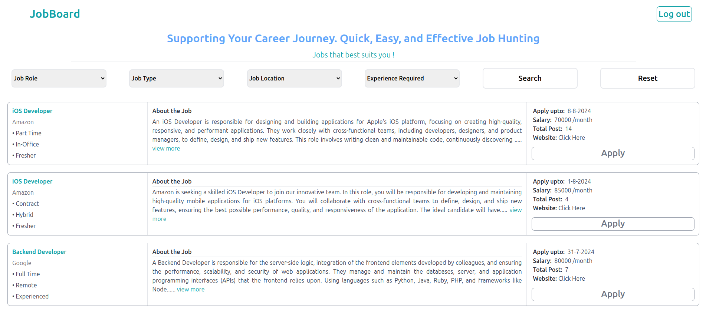
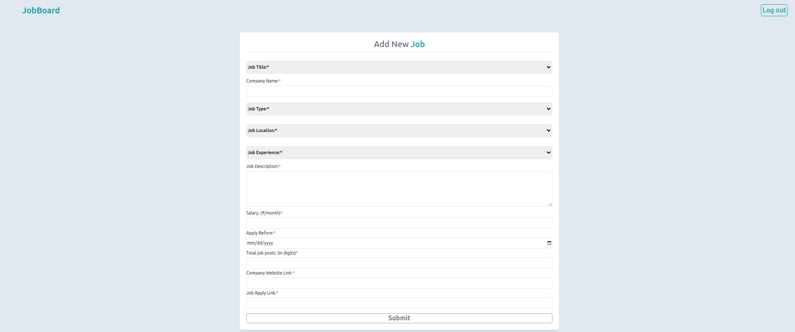

# Job Board


🔗 **Live Preview:** [Visit Job Board](https://jobboardproject.netlify.app/)

## 🚀 About the Project
The **Job Board** is a web application that helps users find job opportunities and employers to post job listings. It features a modern UI, authentication, job search, and job posting functionalities.

## 🛠 Technologies Used
- **React.js** - Frontend framework
- **Tailwind CSS** - Styling
- **React Router** - Navigation
- **Node.js & Express.js** - Backend API
- **MongoDB** - Database for storing jobs and user data

## 📸 Screenshots
### 1️⃣ Homepage


### 2️⃣ Login & Signup


### 3️⃣ Job Search Page


### 4️⃣ Job Posting Page


## 📂 Project Structure
```
JobBoard/
│── frontend/        # React frontend
│── backend/         # Express.js backend
│── .env             # Environment variables
│── README.md        # Project documentation
```

## 📸 Features
✔️ User authentication (Signup/Login/Logout)<br>
✔️ Search and filter job listings<br>
✔️ Post new jobs (for employers)<br>
✔️ Fully responsive UI<br>
✔️ Secure API with authentication

## 📬 Contact
If you have any questions, feel free to reach out:
- 📧 Email: your-email@example.com
- 💼 LinkedIn: [My LinkedIn](https://www.linkedin.com/in/prashant-maurya-017776246/)
- 🐙 GitHub: [@Prashant1510](https://github.com/Prashant1510)

---
🌟 *Don't forget to star the repo if you like it!* 🚀
